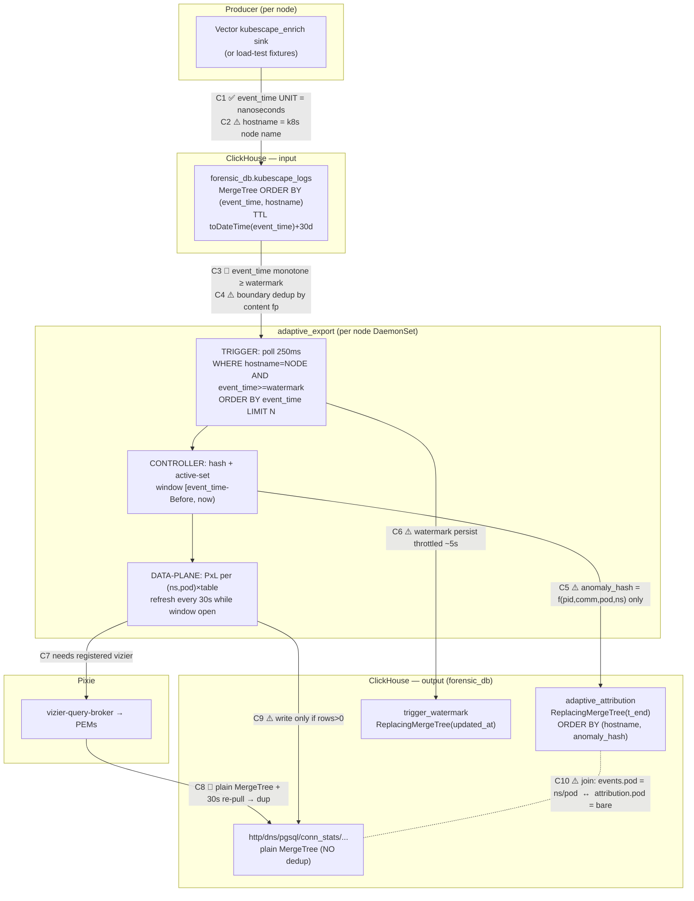
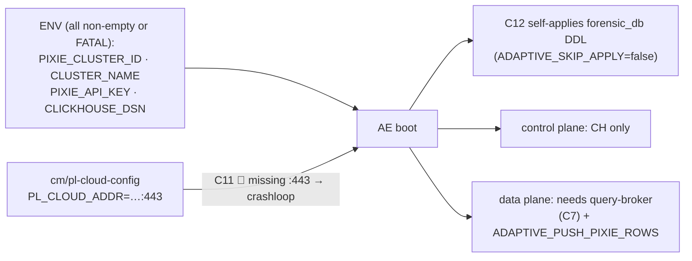
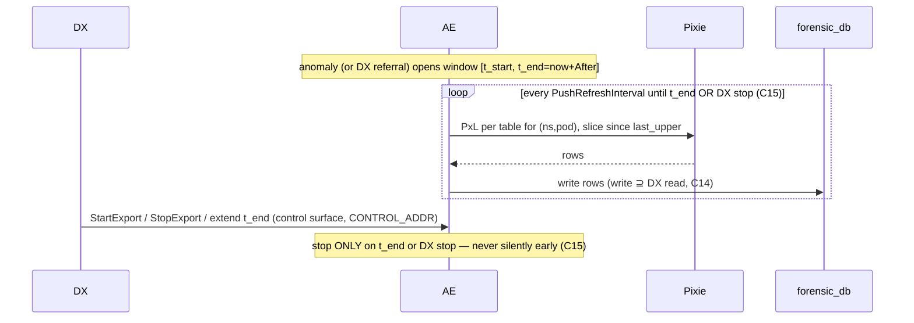

# Adaptive Export (AE) — implied contracts

What AE *currently assumes but does not enforce*. Each ⚠️ is an **implied** contract
(a silent assumption); 🔴 marks ones we've observed violated, with the fix. Grounded
in `src/vizier/services/adaptive_export/` (trigger, controller, sink, config) + the
`forensic_db` DDL.

## End-to-end data flow + where each contract sits

## Boot / dependency contract

## Contract register

| # | Contract (implied) | Enforced? | Status / fix |
|---|---|---|---|
| C1 | `kubescape_logs.event_time` is unix **nanoseconds** (one unit end-to-end) | ✅ DDL converts with `fromUnixTimestamp64Nano`; trigger keeps magnitude-normalization as a defensive net | Vector emits ns; DDL + harness aligned to ns (was the F1/F8 seconds-vs-ns root) |
| C2 | `hostname` = the k8s **node** name (AE polls `WHERE hostname=node`) | ❌ convention only | ⚠️ fixtures must use a real node, else no AE ever reads them |
| C3 | every new anomaly's `event_time` ≥ current watermark (monotone) | ❌ strict HWM filter | 🔴 **F8** — a larger-unit / out-of-order / future row poisons the HWM → all later rows silently dropped. **Fix (PR #53):** normalize cursor to nanos (`chNormEventTimeNanos`); AE-9: ingest-order cursor / bounded-lookback+dedup + below-watermark metric |
| C4 | rows sharing `event_time` at the boundary are deduped by content fingerprint | ✅ `seenAtBoundary` | ok |
| C5 | `anomaly_hash = SHA256(pid,comm,pod,ns)[:16]` — identity is the **workload**, independent of event_time/RuleID | ✅ | ok (N events for one target → 1 attribution row) |
| C6 | `trigger_watermark` persisted value tracks the live cursor | ❌ throttled ~5s | ⚠️ external readers/restart see up to 5s stale; AE-7 flush-on-shutdown |
| C7 | data-plane requires a **registered** vizier query-broker | ❌ | ⚠️ control plane works without it; data plane silently does nothing |
| C8 | re-pulling a window is idempotent | ❌ protocol tables plain MergeTree (no dedup) + 30s re-pull | 🔴 duplicate inflation. **Fix:** single-shot (`ADAPTIVE_PUSH_REFRESH_SEC=-1`, or `AFTER<refresh`); AE-6 ReplacingMergeTree protocol tables |
| C9 | a protocol table row is written only if Pixie returned ≥1 row | ✅ `WritePixieRows len==0 → nil` | ok (empty workload → 0 rows, by design) |
| C10 | join key: `events.pod` = `"ns/pod"` (upid_to_pod_name) vs `adaptive_attribution.pod` = **bare** pod | ❌ asymmetric | ⚠️ consumers must `concat(namespace,'/',pod)` to join (burned the volume tool) |
| C11 | `PL_CLOUD_ADDR` carries `:443` | ❌ | 🔴 missing → AE crashloops / 0 writes (per-PG fix) |
| C12 | AE owns + self-applies the `forensic_db` DDL | ✅ when `ADAPTIVE_SKIP_APPLY=false` | ok; but DDL TTL/PARTITION assume seconds (C1) |
| C13 | `adaptive_attribution` / protocol writes are durable | ❌ best-effort: logged, non-fatal, **not retried** | 🔴 silent loss under CH hiccup; AE-4 retry+count |
| C14 | **DX⊇AE invariant**: AE write-set ⊇ DX read-set (AE persists everything dx queries) | ❌ by convention | ⚠️ validated per-table in the load-test, not enforced in code |
| C15 | **Write-duration (the one DX steers on):** once an anomaly opens a pod's window, AE **keeps re-pulling + writing that pod's forensic data continuously** until `t_end` expires OR DX explicitly stops it. `t_end = now + After`, extended by each new anomaly for the hash. | ❌ partial | 🔴 **last week's "wrote then stopped" bug.** Premature stop modes under investigation (E8-data RCA): (a) F8 — extension anomalies dropped → `t_end` not extended → expires early; (b) EmptyResultSkip negative cache skips a (pod,table) mid-window after N empty pulls; (c) prune/in-flight race; (d) my `PUSH_REFRESH=-1` single-shot is a TEST affordance that *violates* this contract (writes once) — production must re-pull. |

## DX steering contract (what DX can rely on / control)

- **DX controls:** (1) open/extend a window (each referral/anomaly extends `t_end`), (2) explicit **StopExport** via the control surface (`CONTROL_ADDR`, design rev-3 — confirm wired), (3) the active set (which pods AE over-captures).
- **DX relies on:** C5 (stable hash identity), C14 (write ⊇ read), **C15 (no premature stop)**, C9 (0 rows only when the workload is genuinely silent), C10 (the `ns/pod` ↔ bare join). For DX to steer dependably, C3/C8/C13/C15 must move from 🔴 to ✅.

## Legend
✅ enforced in code · ⚠️ implied (assumed, not checked) · 🔴 observed violated (fix noted).
Full repro + backlog: `FINDINGS_AND_BACKLOG.md`. The fixes for C3/C1 are on PR #53 (`ae-prod`).
